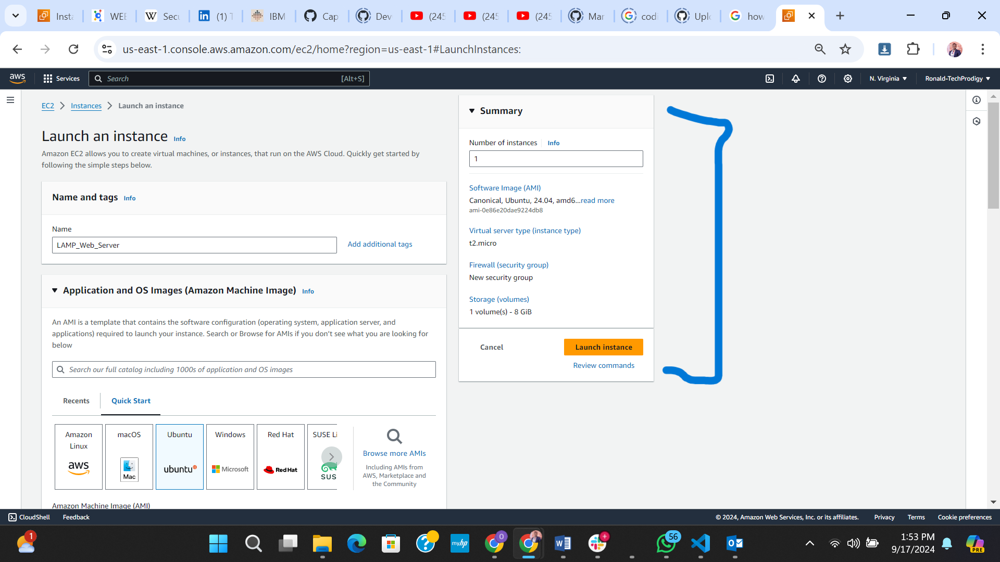
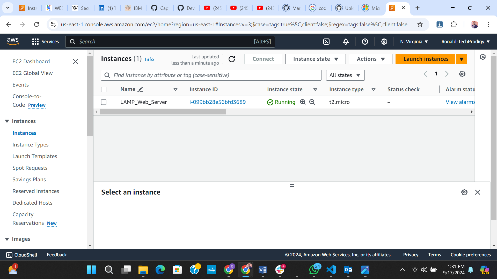
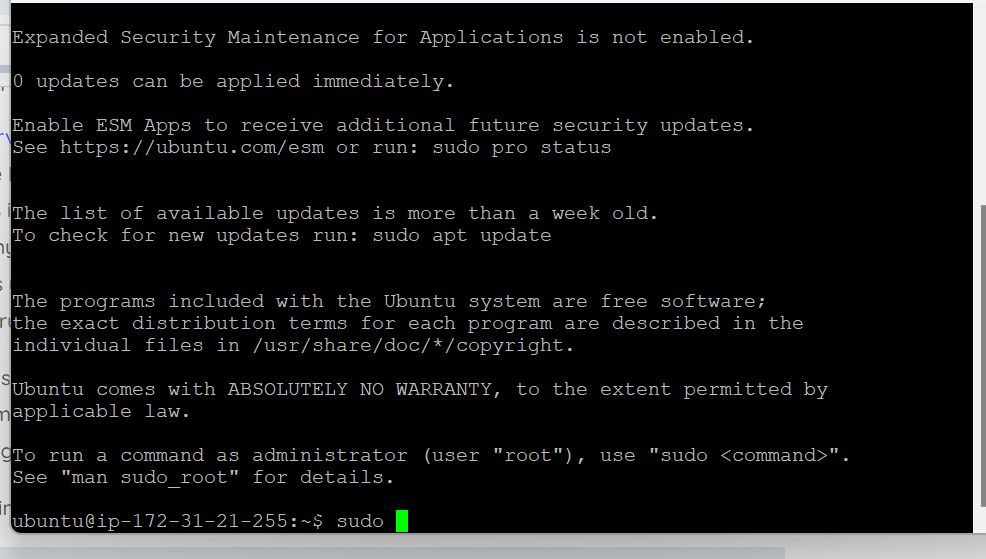
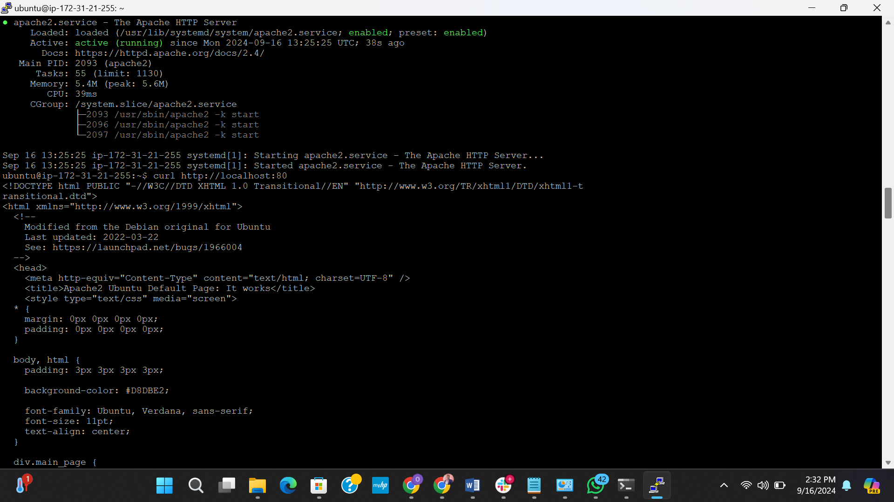
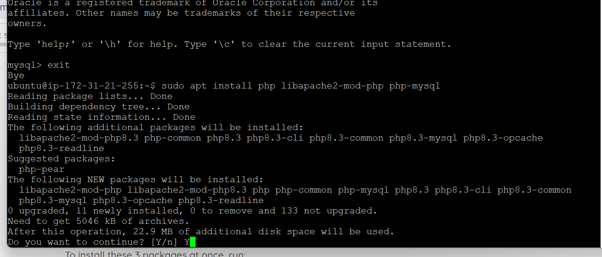

# WEB STACK IMPLEMENTATION IN AWS (LAMP STACK)
This project marks the start of my DevOps Training/learning journey at StegHub.
____

This project comprises of four (4) frameworks combined to guarantee its succesful execution, which are:

1. Linux: Linux plays a crucial role in today's    server architecture and application development due to its stability and reliability, making it the preferred operating system for servers worldwide. Its open-source nature allows developers to customize and optimize their environments, fostering innovation and collaboration. The extensive support for a wide range of programming languages and frameworks enhances its versatility in application development. Additionally, Linux's strong security features help protect against vulnerabilities, making it a trusted choice for both enterprise and cloud environments.

1. Apache: Apache is one of the most widely used web servers, powering a significant portion of the internet. Its modular architecture allows developers to customize and extend functionality easily, accommodating various web applications and services. Apache's robust support for multiple programming languages and frameworks enhances its flexibility, enabling developers to implement diverse solutions. Furthermore, its strong community support ensures continuous updates and security enhancements, making it a reliable choice for hosting websites and applications.

1. MySQL: MySQL is a critical component of many tech stacks due to its reliability and performance as a relational database management system. It efficiently handles large volumes of data, making it ideal for applications that require quick data retrieval and complex queries. MySQL’s compatibility with various programming languages and frameworks enhances its flexibility, allowing developers to integrate it seamlessly into their applications. Additionally, its strong support for transactions and data integrity ensures that applications can maintain consistency and security in their data operations.

1. PHP: PHP is essential in web development as a server-side scripting language that powers dynamic content generation. Its simplicity and ease of use allow developers to quickly create and deploy applications, making it a popular choice for both beginners and experienced programmers. PHP's extensive ecosystem of frameworks and libraries, such as Laravel and Symfony, accelerates development and promotes best practices. Furthermore, its strong integration with databases like MySQL enables seamless data handling, making it a foundational component for building robust web applications

---
## Prerequisite Steps 
* Creating an AWS Account.
* Logging into the account 


* Creating an Elastic Computer Cloud (EC2) Instance


EC2 Instance Properties
* Select a region and launch an instance of t2.micro family with Linux ubuntu server.
* Create a new .ppk which is supported on putty or create a .pem priavte key then later use it to generate Putty .ppk file (If you don't have one already) and save it securely.

* Configure your security groups by ensuring that the following ports are allowed:

   * SSH (port 22) – for remote access

   * HTTP (port 80) – for web traffic







* SSH-[Secured Shell Protocol](https://en.wikipedia.org/wiki/Secure_Shell "SSH")



## Steps to implement the LAMP project 
1. Install Apache Server on the Ubuntu Linux EC2 instance using the CLI commands:
```bash
$ sudo apt update
$ run apache2 package installation
$ sudo apt install apache2
```
To verify that Apache2 is running run the command:

```bash
$ sudo systemctl status apache2
```


2. Accessing our Apache Server page via port 80.

To access the page locally on Ubuntu shell, run: 
```bash
$ curl http://localhost:80
or
$ curl http://127.0.0.1:80
```



Next open your web browser and try to access the page after the curl command
```
http://<Public-IP-Address>:80
```
The result is shows this image:


1. Installing MySQL
MySQL serves as our Database Management System (DBMS). Install it on Ubuntu server using these command:

Note: choose Y for yes during the installation process.
```
$ sudo apt install mysql-server
```
To log into MySQl type:
```
$ sudo mysql
```
You should get a welcome image


It is recommended you run a security script pre-installed with MySQL. It removes insecure default setting to lock out unauthorise access to your database system. The root user password will also be set using mysql_native_password as default authentication method. 
```bash
ALTERUSER'root'@'localhost' IDENTIFIED WITH mysql_native_password BY'<insert password here>';
```
Exit the MySQl database using simply:
```
mysql> exit
```
Start the interactive script by running:
```
$ sudo mysql_secure_installation
```
When finished, test if you can log in to the MySQl console using: 
```
$ sudo mysql -p
```
Exit after succesful log in:

```
mysql> exit
```

1. Installing PHP
PHP in this project is the backend programming language that powers the web app. In addition to the php package, a php-mysql, libapache2-mod-php plug-in are installed, it allows PHP to communicate with MySQl-base databases and libaoache2 enables Apache to handle PHP files.

To  install these 3 packahges at once, run the command
```bash
$ sudo apt install php libapache2-mod-php php-mysql
```


Run this command to check if php has been installed.
```bash
$ php -v
```
### Wonderful LAMP (Linux, Apapche, MYSQL, PHP)Stack is fully installed and operational.

## NEXT
### Configuring HTTP Server on Apache
In this stage the idea of virtual host comes in, this refers to term used to denote hosting many web pages on a single Apache server, so that the server serves various web pages or resource to different clients/user via routing trafiic to a specific IP address of each hosted site.


## Creating a Virtual Host for your Website using Apache.
1. Creating a directory using any name of your choosing, in this project I will use the "projectlamp"
```bash
$ sudo mkdir /var/www/projectlamp
```
Change ownership of the directory with respect to the $USER environment variable, with reference with the current user:
```bash
$ sudo chown -R $USER:$USER /var/www/projectlamp
```
Create and open new configuration file in Apache's sites-available directory using vim editor.
```bash
$ sudo vi /etc/apapche2/sites-available/projectlamp.conf
```
Paste the following bare-bones configuration in the .conf :

 Save the config file by pressing Esc. the pressing Shift + : and type wq (w for write and q for quit).

 Use the *"ls"* command to show the new directory: site-available.
 ```bash
 $ sudo ls /etc/apache2/sites-available
 ```
 Notice the three configs files: 
 ***000-default.conf, default-ssl.conf and projectlamp.conf***

 To enable the new virual host, use the *"a2ensite"* command:
 ```bash
 $ sudo a2ensite projectlamp
 ```
 To disable the default website that come with Apache, use the **"a2disste 000-default"** command
 ```bash
 $ sudo a2diissite 000-default
 ```

 Test for syntax errors, run the command
 ```bash
 $ sudo apapche2ctl configtest
 ```
 Finally, reload Apache so the changes take effect:
 ```bash
 $ sudo systemctl reload apache2
 ```

 ## Testing the site on Apache
 1. Create a custom index.html file saved in /var/www/projectlamp/.
 1. Copy and paste the url the **http//public-IP-Address:80** or **http//localhost:80**

 

 ## DirectoryIndex Settings on Apache
 Access the directoryindex setting directory to change the precedence from index.html to index.php.
 ```bash
 $ sudo vim /ect/apache2/mods-enabled/dir.conf
 ```
 

Change the precedence for index.php to come first.

Save and Close the file, then reload apache.
```bash
$ sudo systemctl reload apache2
```
Create a new index.php file in the root folder and test the change effect.

```bash
$ vim /var/www/projectlamp/index.php
```
Open the black file and add this

```bash
<?php
phpinfo();
```
Save and close then reload the browser, you should see this page.


## Congratulations!!! You have deployed a LAMP Stack website in AWS Cloud.

