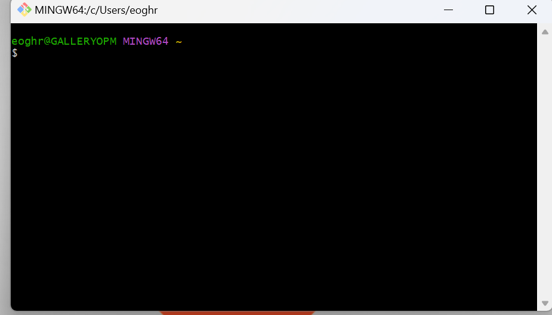

# STEGHUB DevOps Training
**LEMP STACK PROJECTS**

# Step 0 - Preparing Prerequisites

In order to complete this project, you will need an AWS account and a virtual server with Ubuntu Server OS.

## AWS Account Setup

If you do not have an AWS account, follow these steps:

1. **Sign in to AWS Free Tier Account**:
   - Go back to **Project 1 Step 0** to sign up for the AWS Free Tier account.
   - Follow the instructions to create a new account if you haven't done so already.
  
    

2. **Create a New EC2 Instance**:
   - Navigate to the EC2 Dashboard in your AWS Management Console.
   - Click on **Launch Instance** and select **t2.micro** family.
   - Choose the **Ubuntu Server 22.04 LTS (HVM)** image.


   Remember, you can have multiple EC2 instances, but make sure you **STOP** the ones you are not working with at the moment to save available free hours.


## Connecting to EC2 Instance using Git Bash

### Install Git Bash

Download and install Git Bash from the [official Git website](https://gitforwindows.org/).


### Connect to EC2 Instance


1. **Open Git Bash**:
   - *Type `Git Bash` in the search bar.*
   - *Double-click on `Git Bash icon` to start *



2. **Run the command**:
   - ```bash
     $ cd <into the directory that contains your .pem remote server key>
     $ ssh -i <private key> ubuntu@ec2-18-234-179-169.compute-1.amazonaws.com
     ```
     
   - Follow the instructions and restart your computer once the process is completed.
  

Replace `<Your-private-key.pem>` with the path to your private key file and `<EC2-Public-IP-address>` with the public IP address of your EC2 instance.

### Example Command

If your private key file is named `lemp_key.pem` and your EC2 instance's public IP address is `192.52.1.13`, the command would look like this:

```sh
ssh -i lemp_key.pem ubuntu@192.52.1.13
```

By using Git Bash, you can avoid the need to convert your `.pem` key to a `.ppk` key, simplifying the process of connecting to your EC2 instance.